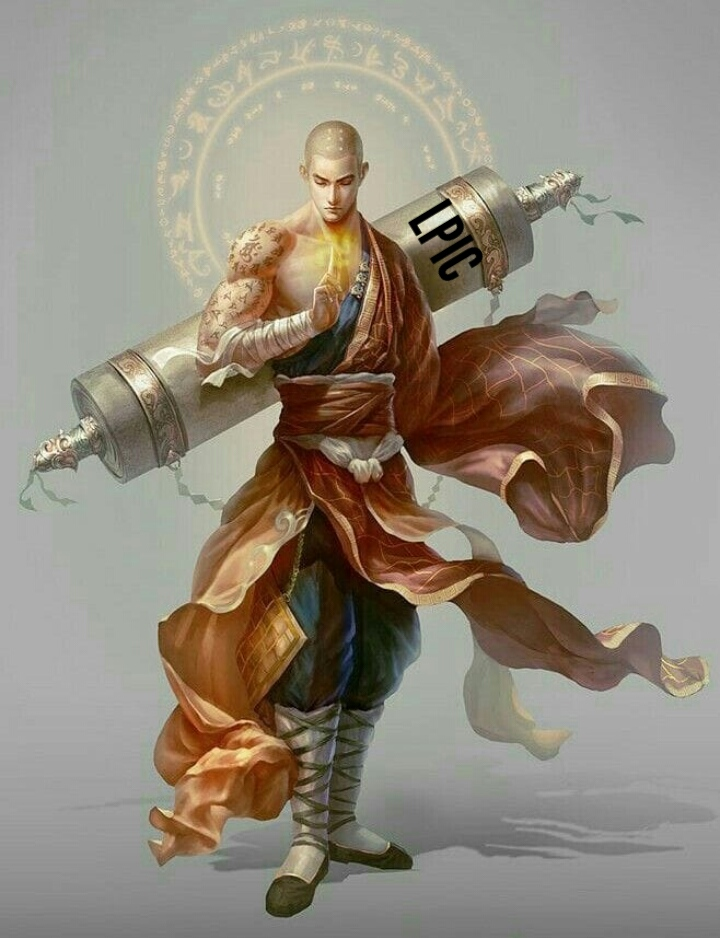

# **Zet**

Saludos, soy Jose, usuario de Debian desde hace unos años y certificado en LPIC1.

Disfruto dedicando tiempo al estudio de nuevas tecnologías y jugando con pequeños proyectos en mis Raspberry Pi.

En mis repositorios se encontrarán mis proyectos personales y guías sobre diferentes tecnologías (según los vaya pasando desde mis apuntes aquí), servíos de lo que consideréis útil.

  

